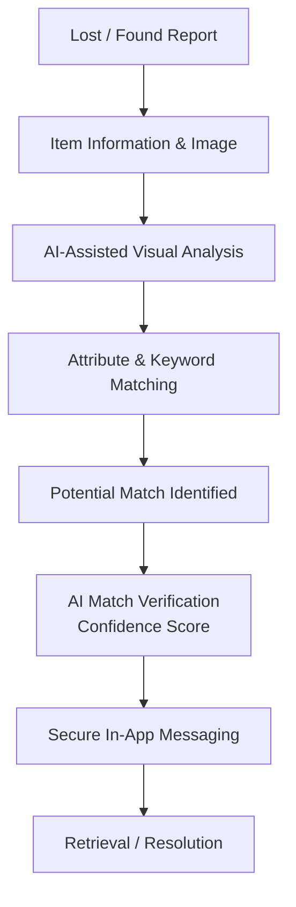
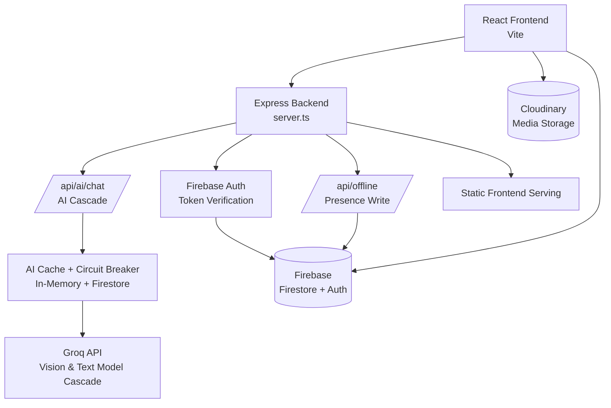

<div align="center">

<pre>
██████╗ ███████╗████████╗██████╗ ██╗██╗   ██╗ █████╗
██╔══██╗██╔════╝╚══██╔══╝██╔══██╗██║██║   ██║██╔══██╗
██████╔╝█████╗     ██║   ██████╔╝██║██║   ██║███████║
██╔══██╗██╔══╝     ██║   ██╔══██╗██║╚██╗ ██╔╝██╔══██║
██║  ██║███████╗   ██║   ██║  ██║██║ ╚████╔╝ ██║  ██║
╚═╝  ╚═╝╚══════╝   ╚═╝   ╚═╝  ╚═╝╚═╝  ╚═══╝  ╚═╝  ╚═╝
</pre>

<b>Intelligent Campus Lost & Found System</b>

<i>Traces Lead to Retrieval</i>

<br/>

[](https://react.dev)
[](https://nodejs.org)
[](https://firebase.google.com)
[](https://groq.com)
[](https://vitejs.dev)
[](#license)

</div>

---

## Overview

**RETRIVA** is a centralized campus lost-and-found platform built to replace scattered, manual recovery processes with a single, intelligent system. Students and staff can report lost or found items, receive AI-assisted match suggestions, verify ownership with supporting evidence, and coordinate retrieval — all without exposing personal contact details.

RETRIVA is designed for **educational campuses**, where lost-and-found activity is frequent, high-volume, and currently handled through informal, unreliable channels.

<br/>

## Problem Statement

On most campuses, lost-and-found management still relies on physical drop boxes, notice boards, or informal WhatsApp groups. This approach breaks down at scale:

- **No central record** — items sit unclaimed in boxes with no searchable log.
- **Fragmented communication** — reports are scattered across group chats that are impossible to search or moderate.
- **Terminology mismatch** — a report for a "MacBook" never connects with a found "Apple laptop," because keyword-based searching can't recognize that they're the same thing.
- **No verification step** — ownership is often confirmed by informal conversation rather than evidence, creating room for error or misuse.
- **No privacy safeguards** — photos of found items may accidentally expose faces, ID cards, or other sensitive information.

The result is slow recovery, lost items that are never reclaimed, and no institutional visibility into how lost-and-found activity is actually handled.

<br/>

## Proposed Solution

RETRIVA consolidates the entire lost-and-found lifecycle into one platform:

1. Users submit **lost** or **found** item reports, with a description and photo.
2. AI-assisted analysis extracts structured details from the image to reduce manual data entry.
3. Candidate matches are surfaced using category, location, and keyword overlap across reports — enriched by the AI-extracted tags and specs, not just the user's raw text.
4. Potential matches are surfaced to both parties, who can compare items side by side with an AI-generated **Match Confidence Score**.
5. Verified matches move into secure, in-app messaging to coordinate retrieval, without exchanging phone numbers.
6. Every report carries a live status (**Open** / **Resolved**), keeping the database accurate and administrators informed.

<br/>

## How RETRIVA Works



<br/>

## Key Features

### AI & Intelligent Matching

| Feature | Description |
|---|---|
| **Auto-Description** | Uploading a photo sends it to a vision-capable AI model, which extracts color, category, brand/model specs, and descriptive tags, and drafts a clean title and description. It also cross-checks the image against the user's own text and flags contradictions (e.g., a "blue backpack" that is visibly a red one). |
| **Attribute & Keyword Matching** | Candidate matches are found by comparing category, location, and keyword overlap across titles, descriptions, and AI-extracted tags/specs between opposite-type reports (a lost report is matched against found reports, and vice versa). This is a deterministic scoring step, not a learned embedding search. |
| **Match Comparator** | Two candidate items can be sent to the AI for a side-by-side verification pass, which weighs titles, descriptions, specs, and photos to produce a **Match Confidence Score** with a written explanation, similarities, and differences — evidence to support, not replace, human judgment. |
| **Natural-Language Search** | Free-text search queries are parsed by the AI to infer whether the user means a lost or found item and to extract cleaner search keywords. |

Every AI-assisted step has a non-AI fallback: if the AI service is unavailable, candidate matching and comparison automatically fall back to text-based heuristics so the app keeps working.

### Privacy & Safety — Guardian AI

| Safeguard | Description |
|---|---|
| **Face / Human Detection** | The vision AI screens uploaded images for identifiable people and rejects submissions that contain them. |
| **Harmful & Irrelevant Content Screening** | Uploads are also screened for graphic/violent content, live animals, and prank or irrelevant images, which are rejected before a report can be published. |
| **Sensitive Document Policy** | Users are explicitly notified and required to agree that uploading sensitive documents (IDs, passports, cards) is prohibited before submitting a report, alongside the automated content checks above. |

### Communication & Notifications

- **Real-Time In-App Messaging** — chat between users is powered by live Firestore listeners, so messages and read/online status update instantly without a page refresh, and retrieval can be coordinated without sharing personal phone numbers.
- **Proactive Match Alerts** — the app periodically re-checks a user's open lost reports against new activity and surfaces high-confidence matches as in-app notifications and, where the browser permits it, native browser notifications.

### Report Management

- **Live Status Tracking** — reports are marked `Open` or `Resolved`, keeping listings current.
- **Structured Reporting** — consistent item data improves searchability and matching accuracy.
- **Auto-Generated Student Identifiers** — each account is assigned a unique, system-generated student ID at signup.

### Administration & Analytics

- **User Management** — verify, edit, or restrict user accounts.
- **Reports Management** — review, moderate, or resolve item reports, including flagged submissions.
- **Admin Management** — manage administrator accounts and permissions.
- **Audit Log** — every administrative action is recorded with the acting admin, target, and reason for accountability.
- **Analytics Dashboard** — charted insights into report volume by day and category, resolution counts, average resolution time, and AI usage.
- **Maintenance Controls** — platform-level maintenance settings for administrators.

<br/>

## AI Capabilities

RETRIVA's AI layer is **assistive**, not autonomous — it supports users and administrators with faster analysis and verification, while final judgment remains a human decision. AI calls run through a backend cascade across multiple Groq-hosted models (a vision-capable model tier for image analysis, and text model tiers for comparison and search parsing), with automatic fallback between models and a response cache to keep the experience fast and resilient.

- **AI-Assisted Visual Analysis**: Extracts descriptive attributes (color, category, brand/model specs, tags) from uploaded images and drafts a title/description.
- **Attribute & Keyword Candidate Matching**: A deterministic scoring step (category, location, and keyword overlap) narrows down likely matches without requiring an AI call for every comparison.
- **AI Match Comparison & Confidence Scoring**: A dedicated AI pass verifies whether two candidate items are plausibly the same physical object and returns a confidence score with reasoning.
- **Content Safety Checks**: Screens uploads for people/faces, graphic content, and irrelevant or prank images before they are published.

RETRIVA does not claim perfect accuracy or fully automated resolution — AI outputs are intended to assist and accelerate the recovery process, with users and administrators making the final call. Every AI-dependent step degrades gracefully to a text-based fallback if the AI service is unavailable.

<br/>

## Privacy & Safety

Privacy is enforced **before** content is published, not after. Every uploaded image passes through Guardian AI, which:

- Rejects uploads containing identifiable human faces or other people.
- Rejects graphic/violent content, live-animal images, and prank or irrelevant submissions.

In addition, users must explicitly acknowledge a data-handling policy that prohibits uploading sensitive documents (student IDs, passports, payment cards) before submitting a report. Firestore security rules further govern who can read or write report, chat, and user data at the database level.

This ensures that lost-and-found listings only surface information relevant to identifying an item — nothing more.

<br/>

## System Architecture



RETRIVA runs a dedicated Express backend (`server.ts`) alongside its React frontend. In production it is deployed as a Vercel serverless function (`api/index.ts` wraps the same Express app); in development it runs standalone via `tsx`. The backend verifies Firebase Auth tokens, proxies AI requests to Groq through a cascade-and-cache layer, and writes presence/audit data to Firestore using the Firebase Admin SDK — the frontend never calls Groq or Firestore Admin directly.

<br/>

## Technology Stack

| Layer | Technology |
|---|---|
| **Frontend** | React 19 + TypeScript |
| **Styling / UI** | Tailwind CSS, Lucide Icons |
| **Charts** | Recharts (admin analytics) |
| **Backend** | Node.js + Express (`server.ts`), deployed as a Vercel serverless function |
| **Authentication** | Firebase Authentication (email/password + Google Sign-In), verified server-side via Firebase Admin |
| **Database** | Cloud Firestore (client SDK for app data, Firebase Admin SDK for server-side caching/audit writes) |
| **AI** | Groq API — a cascading set of Groq-hosted vision and text models, with automatic fallback, response caching, and rate-limit cooldown handling |
| **Media / Storage** | Cloudinary (image hosting; images are uploaded here before AI analysis) |
| **Build / Development** | Vite, esbuild, tsx |

<br/>

## Project Structure

```
retriva/
├── api/
│   └── index.ts          # Vercel serverless entry point (wraps the Express app)
├── components/            # UI components
│   └── admin/              # Admin dashboard, user/report management, analytics, audit log
├── services/
│   ├── firebase.ts          # Firebase client SDK setup (Auth + Firestore)
│   ├── cloudinary.ts        # Client-side image upload to Cloudinary
│   ├── aiService.ts         # AI-assisted analysis, matching, and comparison logic
│   └── adminService.ts      # Admin audit logging
├── tests/
│   └── ai-cascade.test.ts   # Tests for the AI model cascade
├── App.tsx                 # Root application component
├── index.tsx                # Frontend entry point
├── server.ts                 # Express backend: auth verification, AI proxy/cascade, presence
├── types.ts                   # Shared TypeScript types
├── firestore.rules             # Firestore security rules
├── vercel.json                  # Vercel deployment configuration
├── vite.config.ts
└── .env                          # Environment variables (not committed)
```

<br/>

## Getting Started

### Prerequisites

- Node.js `22.x`
- A [Firebase project](https://console.firebase.google.com/) with Firestore and Authentication enabled
- A [Groq API key](https://console.groq.com/)
- A [Cloudinary account](https://cloudinary.com/)

### Installation

```bash
git clone https://github.com/The-4Script/retriva.git
cd retriva
npm install
```

### Environment Variables

Create a `.env` file in the project root:

```env
# Backend
FIREBASE_PROJECT_ID=
FIREBASE_SERVICE_ACCOUNT_KEY=      # Optional: enables persistent AI cache, rate-limit circuit breaker, and presence writes
GROQ_API_KEY=

# Frontend (Vite)
VITE_FIREBASE_API_KEY=
VITE_FIREBASE_APP_ID=
VITE_FIREBASE_AUTH_DOMAIN=
VITE_FIREBASE_DATABASE_ID=
VITE_FIREBASE_MESSAGING_SENDER_ID=
VITE_FIREBASE_PROJECT_ID=
VITE_FIREBASE_STORAGE_BUCKET=
VITE_CLOUDINARY_CLOUD_NAME=
VITE_CLOUDINARY_UPLOAD_PRESET=
```

> `FIREBASE_PROJECT_ID` and `VITE_FIREBASE_PROJECT_ID` must point to the same Firebase project, or backend token verification will fail.

### Development

```bash
npm run dev
```

### Production Build

```bash
npm run build   # Builds the frontend with Vite and bundles server.ts with esbuild
npm start       # Runs the production build
```

<br/>

## Innovation / USP

What sets RETRIVA apart from a conventional lost-and-found notice board:

- **AI-enriched matching** — AI-extracted tags and specs from photos feed into the matching logic, so items are compared on more than just what a user manually typed.
- **Multimodal understanding** — combines image and text analysis to reduce manual effort during reporting.
- **Privacy-first content checks** — every image is screened for people and unsafe content before it becomes visible to anyone.
- **Evidence-based verification** — a Match Confidence Score, backed by an AI-generated explanation, replaces guesswork with a structured comparison.
- **Centralized, real-time coordination** — one platform with live in-app messaging replaces fragmented group chats and physical boxes.
- **Resilient by design** — AI-dependent features fall back to deterministic logic automatically if the AI service is degraded or unavailable.

<br/>

## Impact

RETRIVA is designed to improve campus lost-and-found outcomes by:

- Reducing the time it takes to reconnect lost items with their owners.
- Replacing fragmented, unsearchable group chats with a structured, centralized system.
- Giving administrators clear visibility into active and resolved reports.
- Reducing privacy risks in item photos through automated screening.
- Providing an evidence-based verification step before items are handed over.

<br/>

## Future Scope

The following directions are potential extensions and are **not yet implemented**:

- Integration with campus security or administrative systems for verified handovers.
- Expanded analytics dashboards for institutional reporting.
- Multi-campus or multi-institution deployment support.

<br/>

## Contributing

This is an educational project developed as part of a Smart India Hackathon initiative. Contributions, issues, and suggestions are welcome — please open a GitHub Issue to discuss proposed changes.

<br/>

## License

© 2026 Team ForgeScript. Created for educational purposes as part of a Smart India Hackathon submission. All rights reserved.

<br/>

<div align="center">

*Trace Lead to Retrieval.*

Built by **Team ForgeScript**

</div>
